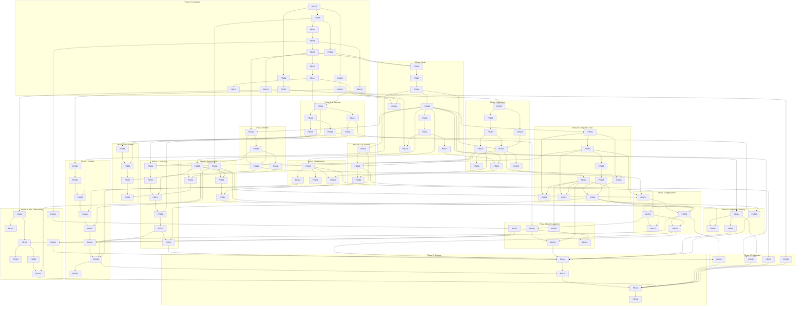

# Incasif - Implementation Plan (Index)

| | |
|---|---|
| **Versi** | 3.0 (dipecah per phase dari docs/PR-PLAN.md - isi PR verbatim, tanpa perubahan scope) |
| **Tanggal** | 2026-07-15 |
| **Source of truth** | PRD v1.1 (bisnis) + SDD v1.1 (teknis) + ADR-001..018 (docs/adr/) |
| **Skala kompleksitas** | XS < 1 hari - S 1-2 hari - M 2-4 hari - L 4-7 hari - XL dilarang |
| **Total** | 112 PR - 18 phase - 8 sprint (+2 minggu soak/rilis) |

Panduan untuk AI coding agent: kerjakan PR sesuai **Execution Order** di bawah; sebelum memulai sebuah PR, baca file phase-nya (Objective/Scope/Technical Notes/AC) + pastikan seluruh PR di kolom Dependencies sudah merged. Satu PR = satu branch = satu unit review.

## Konvensi Global

Konvensi global (berlaku semua PR, tidak diulang): lint boundaries lolos; validasi zod dari `packages/schemas`; error envelope `{code,message,hint}` Bahasa Indonesia sederhana; PR frontend lolos a11y gate CI (axe + jsx-a11y + Lighthouse); panggilan AI hanya via AI Gateway; tidak ada PII/secret di log; PR < 500 LOC bila memungkinkan.

Rollback baku (dirujuk sebagai **RB-Std**): revert merge → CI build ulang image → `deploy.sh --rollback` ke digest sebelumnya; migrasi DB backward-compatible satu versi sehingga TIDAK di-rollback bersama image; bila PR berisi migrasi destruktif, migrasi down disertakan dan diuji.

## Daftar Phase

| Phase | Nama | File | PR | Sprint |
|---|---|---|---|---|
| 01 | Foundation | [phase-01-foundation.md](phase-01-foundation.md) | PR-001..PR-015 (15) | 1 |
| 02 | Authentication & Account | [phase-02-authentication-account.md](phase-02-authentication-account.md) | PR-016..PR-024 (9) | 2 |
| 03 | Web Platform Base | [phase-03-web-platform-base.md](phase-03-web-platform-base.md) | PR-025..PR-033 (9) | 2-4 |
| 04 | Accessibility Experience | [phase-04-accessibility-experience.md](phase-04-accessibility-experience.md) | PR-034..PR-036 (3) | 3-4 |
| 05 | User Profile | [phase-05-user-profile.md](phase-05-user-profile.md) | PR-037..PR-040 (4) | 4-5 |
| 06 | AI Gateway | [phase-06-ai-gateway.md](phase-06-ai-gateway.md) | PR-041..PR-046 (6) | 3-4 |
| 07 | Notifications | [phase-07-notifications.md](phase-07-notifications.md) | PR-047..PR-050 (4) | 4-5 |
| 08 | Companies & Jobs | [phase-08-companies-jobs.md](phase-08-companies-jobs.md) | PR-051..PR-059 (9) | 5-6 |
| 09 | Resume Builder & PDF | [phase-09-resume-builder-pdf.md](phase-09-resume-builder-pdf.md) | PR-060..PR-064 (5) | 5-7 |
| 10 | AI CV Builder | [phase-10-ai-cv-builder.md](phase-10-ai-cv-builder.md) | PR-065..PR-068 (4) | 6-7 |
| 11 | Matching Engine | [phase-11-matching-engine.md](phase-11-matching-engine.md) | PR-069..PR-074 (6) | 6-7 |
| 12 | Applications | [phase-12-applications.md](phase-12-applications.md) | PR-075..PR-079 (5) | 7-8 |
| 13 | Admin Dashboard & Analytics | [phase-13-admin-analytics.md](phase-13-admin-analytics.md) | PR-080..PR-083 (4) | 7-8 |
| 14 | SignBridge v1 & Simplify | [phase-14-signbridge-simplify.md](phase-14-signbridge-simplify.md) | PR-084..PR-087 (4) | 7-8 |
| 15 | Mobile (Android) | [phase-15-mobile-android.md](phase-15-mobile-android.md) | PR-088..PR-095 (8) | 6-8 |
| 16 | Infrastructure & Observability | [phase-16-infrastructure-observability.md](phase-16-infrastructure-observability.md) | PR-096..PR-104 (9) | 2-5 |
| 17 | Security Hardening & PDP Compliance | [phase-17-security-pdp-hardening.md](phase-17-security-pdp-hardening.md) | PR-105..PR-108 (4) | 8 |
| 18 | Release | [phase-18-release.md](phase-18-release.md) | PR-109..PR-112 (4) | 8+ (minggu 17-18) |

## Execution Order

Urutan eksekusi mengikuti Sprint Roadmap (tabel lengkap di bawah). Ringkas per sprint:

| Sprint | PR (paralel dalam sprint, hormati Dependencies per PR) |
|---|---|
| 1 | 001-015 |
| 2 | 016-028, 096-097 |
| 3 | 029-032, 034, 041-043, 098-099 |
| 4 | 033, 035-039, 044-049, 100-102 |
| 5 | 040, 050-056, 060, 062, 103-104 |
| 6 | 057-059, 061, 063, 065-067, 069-072, 088-089 |
| 7 | 064, 068, 073-077, 080, 083-084, 090-092 |
| 8 | 078-079, 081-082, 085-087, 093-095, 105-110 |
| 8+ | 111-112 (soak 1 minggu lalu launch) |

# Dependency Graph



# Critical Path

Rantai terpanjang yang menentukan tanggal rilis (≈ 23 PR berurutan):

```
PR-001 → PR-006 → PR-008 → PR-009 → PR-010 → PR-011 → PR-016 → PR-017 → PR-018 → PR-019
→ PR-037 → PR-039 → PR-069* → PR-070 → PR-071 → PR-072 → PR-073 → PR-074
→ PR-093 → PR-094 → PR-110 → PR-111 → PR-112
```

\* PR-069 juga menunggu PR-055 (via PR-051) dan PR-041 — jalur Jobs dan AI Gateway berjalan paralel terhadap jalur Profile; yang paling lambat dari ketiganya menentukan kapan PR-069 mulai.

Titik kritis dan mitigasinya:
1. **PR-073 (feed endpoint)** — konvergensi Profiles + AI Gateway + Jobs. Mitigasi: gateway mulai Sprint 3; PR-070 sekaligus berfungsi sebagai spike pgvector.
2. **PR-110 (audit manusia)** — non-kompresibel. Mitigasi: penguji disabilitas terlibat per sprint sejak Sprint 3; PR-109 membersihkan semua yang bisa ditemukan mesin.
3. **PR-094 (mobile apply)** — ekor mobile masuk critical path. Mitigasi: mobile dimulai Sprint 6 (PR-088) agar ekornya pendek; paritas dicapai lewat packages shared.

# Parallel Workstreams

| Workstream | Engineer | PR |
|---|---|---|
| **Backend Core** | BE-1 (lead) | 006–011, 013–024, 037–039, 051, 055–056, 060, 075–077, 080, 083–084 |
| **AI** | BE-2 (BE-1 merangkap bila tim 3) | 041–046, 065–067, 069–073, 087 (BE) |
| **Frontend Web** | FE-1 | 025–036, 040, 050, 052–054, 057–059, 061, 064, 068, 074, 078–079, 081–082, 085–087 (FE) |
| **Mobile** | FE-2 (mulai Sprint 6; sebelumnya bantu web) | 088–095 |
| **DevOps** | DevOps/fullstack (paruh waktu) | 001–003, 012, 062–063, 096–104, 108 |

Pasangan paralel aman per sprint (tanpa berbagi modul/file):
- Sprint 1: (006–008 ∥ 004–005 ∥ 013) → (009–012 ∥ 014–015)
- Sprint 2: (016–018 ∥ 025–028 ∥ 096–097) ; (019–024 ∥ 029)
- Sprint 3: (034 ∥ 041–043 ∥ 030–032 ∥ 098–099)
- Sprint 4: (037–039 ∥ 044–046 ∥ 033, 035–036 ∥ 047–049 ∥ 100–102)
- Sprint 5: (051, 055–056 ∥ 060, 062 ∥ 040, 052–054 ∥ 103–104)
- Sprint 6: (065–067 ∥ 069–072 ∥ 057–059, 061, 063 ∥ 088–089)
- Sprint 7: (073, 075–077 ∥ 064, 068, 074 ∥ 090–092 ∥ 080, 083–084)
- Sprint 8: (078–079, 081–082 ∥ 085–087 ∥ 093–095 ∥ 105–108) → 109 → 110 → 111 → 112

Aturan anti-merge-conflict: kontrak zod dibuat lebih dulu (PR kecil terpisah bila dua track butuh skema sama); satu modul = satu pemilik per sprint; FE menunggu skema, bukan implementasi BE (mock via kontrak PR-004).

# Sprint Roadmap

| PR | Title | Complexity | Dependency | Sprint |
|----|-------|------------|------------|--------|
| PR-001 | Turborepo Workspace & Shared Config | S | — | 1 |
| PR-002 | Lint Boundaries | S | 001 | 1 |
| PR-003 | CI Pipeline Dasar | S | 001, 002 | 1 |
| PR-004 | schemas + OpenAPI Generator | S | 001 | 1 |
| PR-005 | api-client | S | 004 | 1 |
| PR-006 | API Bootstrap config+logger | M | 001, 002 | 1 |
| PR-007 | core/http | M | 006 | 1 |
| PR-008 | Compose Dev + Health | M | 006, 007 | 1 |
| PR-009 | Migrasi Inti Identitas | M | 008 | 1 |
| PR-010 | Migrasi Domain Seeker | S | 009 | 1 |
| PR-011 | Migrasi Marketplace | M | 010 | 1 |
| PR-012 | Seed Data Dev | S | 011 | 1 |
| PR-013 | core/crypto AES-256-GCM | S | 006 | 1 |
| PR-014 | core/audit | S | 009 | 1 |
| PR-015 | core/queue + Worker + DLQ | M | 008 | 1 |
| PR-016 | Auth OTP | M | 009, 013 | 2 |
| PR-017 | Auth Google | S | 016 | 2 |
| PR-018 | JWT + Rotating Refresh | M | 016, 017 | 2 |
| PR-019 | RBAC + Route Registry | M | 018 | 2 |
| PR-020 | Users GET/PUT /me | XS | 019 | 2 |
| PR-021 | Hapus Akun Soft Delete | S | 020 | 2 |
| PR-022 | Ekspor Data PDP | S | 021 | 2 |
| PR-023 | Worker pdp-purge | S | 015, 021 | 2 |
| PR-024 | Retention Jobs | S | 015, 011 | 2 |
| PR-025 | apps/web Bootstrap | M | 001, 005 | 2 |
| PR-026 | packages/a11y Store + Token | M | 025 | 2 |
| PR-027 | ui Batch 1 Form | M | 026 | 2 |
| PR-028 | ui Batch 2 Overlay | M | 027 | 2–3 |
| PR-096 | provision.sh + Hardening | S | 008 | 2 |
| PR-097 | Compose Prod/Staging + Secrets | M | 096 | 2 |
| PR-029 | i18n id/id-simple | S | 025 | 3 |
| PR-030 | Web Auth Pages | M | 018, 027, 029 | 3 |
| PR-031 | A11y Gate CI | S | 030, 003 | 3 |
| PR-032 | Landing + Empty States | S | 030 | 3 |
| PR-034 | Accessibility BE | S | 019 | 3 |
| PR-041 | Gateway Core + Gemini | M | 011, 015 | 3 |
| PR-042 | Groq + Router + Breaker | M | 041 | 3 |
| PR-043 | Quota + ai_usage | S | 041 | 3 |
| PR-098 | Nginx + Certbot + CF | S | 097 | 3 |
| PR-099 | Build → GHCR | S | 003, 008 | 3 |
| PR-033 | Settings Shell | S | 022, 028 | 4 |
| PR-035 | Onboarding Wizard FE | M | 034, 028, 029 | 4 |
| PR-036 | Preferences Panel + Sync | S | 035, 033 | 4 |
| PR-037 | Profiles BE Sensitif | M | 013, 019, 010 | 4 |
| PR-038 | Profiles Sub-entitas | S | 037 | 4 |
| PR-039 | Safe vs Sensitive Access | S | 037, 014 | 4 |
| PR-044 | Prompt Registry + Cache + Guard | M | 043 | 4 |
| PR-045 | SSE chatStream | M | 042 | 4 |
| PR-046 | Kontrak Degradasi | S | 042, 002 | 4 |
| PR-047 | Notifications BE + In-App | M | 019, 015 | 4 |
| PR-048 | Devices + FCM | S | 047 | 4 |
| PR-049 | Email Resend | S | 047 | 4 |
| PR-100 | Deploy Staging + Smoke | S | 099, 097 | 4 |
| PR-101 | Deploy Prod + Rollback | S | 100 | 4 |
| PR-102 | Sentry Semua App | S | 099 | 4 |
| PR-040 | Profile FE | M | 037, 038, 028 | 5 |
| PR-050 | Notification Center FE | M | 047, 028 | 5 |
| PR-051 | Companies BE | M | 019 | 5 |
| PR-052 | Admin Shell FE | M | 030, 028 | 5 |
| PR-053 | Admin Companies FE | S | 051, 052 | 5 |
| PR-054 | Company Public Profile | S | 051, 032 | 5 |
| PR-055 | Jobs BE CRUD | M | 051 | 5 |
| PR-056 | Jobs Search FTS | M | 055 | 5 |
| PR-060 | Resumes BE Manual | S | 019, 010 | 5 |
| PR-062 | core/storage R2 | S | 006 | 5 |
| PR-103 | Kuma + Metrics + Alerts | M | 100, 015 | 5 |
| PR-104 | Backup + Restore Drill | M | 103, 062 | 5 |
| PR-057 | Admin Jobs FE | M | 055, 052 | 6 |
| PR-058 | Web Jobs Browse | M | 056, 028 | 6 |
| PR-059 | Job Detail Page | S | 058, 054 | 6 |
| PR-061 | Resume Editor FE | M | 060, 040 | 6 |
| PR-063 | PDF Render Processor | M | 062, 060, 015 | 6 |
| PR-065 | Chat Sessions BE | S | 044, 019 | 6 |
| PR-066 | CV-Chat SSE + Prompt | M | 065, 045 | 6 |
| PR-067 | Finalize + Ekstraksi | M | 066, 060 | 6 |
| PR-069 | Embedding Pipeline | M | 041, 055, 038 | 6 |
| PR-070 | Candidate Query pgvector | M | 069 | 6 |
| PR-071 | Scoring + Accommodation Fit | S | 070, 039 | 6 |
| PR-072 | Re-rank + Cache | M | 071, 044 | 6 |
| PR-088 | Expo Bootstrap + EAS | M | 005 | 6 |
| PR-089 | ui Native + Lint Label | M | 088 | 6 |
| PR-064 | PDF API + Download | S | 063, 050 | 7 |
| PR-068 | Chat FE + Fallback UX | M | 067, 061 | 7 |
| PR-073 | GET /me/matches + Degradasi | S | 072 | 7 |
| PR-074 | Matching Feed FE | M | 073, 059 | 7 |
| PR-075 | Apply BE + Disclosure | M | 039, 055, 060 | 7 |
| PR-076 | Status Pipeline + Hired | M | 075, 047 | 7 |
| PR-077 | Admin Applications | M | 076, 052 | 7 |
| PR-080 | Admin Metrics BE | M | 076, 043 | 7 |
| PR-083 | Moderasi Suspend | S | 052, 021 | 7 |
| PR-084 | SignBridge BE | M | 019, 011 | 7 |
| PR-090 | Mobile Auth | M | 089, 018 | 7 |
| PR-091 | Mobile Onboarding + Theme | M | 090, 026, 034 | 7 |
| PR-092 | Mobile Profile + CV | M | 091, 060 | 7 |
| PR-078 | Apply FE Disclosure Dialog | M | 075, 059, 064 | 8 |
| PR-079 | Tracking FE + Confirm Hired | S | 076, 078, 050 | 8 |
| PR-081 | Admin Dashboard FE | S | 080, 052 | 8 |
| PR-082 | Analytics Umami + Funnel | M | 079, 097 | 8 |
| PR-085 | Admin Sign-Videos FE | S | 084, 062, 052 | 8 |
| PR-086 | Kamus BISINDO FE | M | 084 | 8 |
| PR-087 | Simplify-Text AI | S | 044, 059 | 8 |
| PR-093 | Mobile Feed + Detail | M | 092, 073 | 8 |
| PR-094 | Mobile Apply + Push | M | 093, 078, 048 | 8 |
| PR-095 | Mobile Notification Center | S | 094 | 8 |
| PR-105 | CSP + Headers + Limits | S | 098, 078 | 8 |
| PR-106 | Authz Matrix Test | S | 019, 084 | 8 |
| PR-107 | Privasi + Runbook Insiden | S | 035 | 8 |
| PR-108 | Dep Audit + Secrets Scan | XS | 003 | 8 |
| PR-109 | A11y Full Sweep | M | 074, 079, 081, 086, 087 | 8 |
| PR-110 | Audit Penguji Disabilitas | M | 109, 094 | 8 |
| PR-111 | RC Soak + Play Readiness | S | 110, 104–108 | 8+ |
| PR-112 | v1.0.0 Launch | XS | 111 | 8+ |

Catatan kapasitas: Sprint 6–8 paling padat — bila tim = 3 engineer, geser PR-084–087 (SignBridge/simplify) dan PR-095 +1 sprint tanpa menyentuh critical path; PR-110/111 TIDAK boleh dikompresi. "8+" = minggu 17–18 (soak + rilis).

# Coverage Matrix

| PRD Requirement | PR |
|---|---|
| FR-1.1 Login Google | PR-017, PR-030, PR-090 |
| FR-1.2 Login OTP WA | PR-016, PR-030, PR-090 |
| FR-1.3 Sesi aman (JWT, logout semua perangkat) | PR-018 |
| FR-1.4 Hapus akun + ekspor data (PDP) | PR-021, PR-022, PR-023, PR-033 |
| FR-2.1 Onboarding profil aksesibilitas | PR-034, PR-035, PR-091 |
| FR-2.2 Preferensi sync lintas perangkat | PR-026, PR-034, PR-036, PR-091 |
| FR-2.3 UI adaptif (kontras/teks/motion/target sentuh) | PR-026, PR-027, PR-028, PR-036, PR-089 |
| FR-2.4 Mode bahasa sederhana | PR-029, PR-087 |
| FR-3.1 AI CV Builder (chat terpandu) | PR-065, PR-066, PR-067, PR-068 |
| FR-3.2 CV manual (fallback wajib) | PR-060, PR-061, PR-092 |
| FR-3.3 CV → PDF | PR-062, PR-063, PR-064 |
| FR-4.1 Kurasi lowongan + taksonomi akomodasi | PR-055, PR-057 |
| FR-4.2 AI Job Matching + penjelasan | PR-069–PR-074, PR-093 |
| FR-4.3 Pencarian & filter | PR-056, PR-058 |
| FR-4.4 Detail lowongan + profil inklusivitas | PR-054, PR-059 |
| FR-5.1 One-tap apply idempotent | PR-075, PR-078, PR-094 |
| FR-5.2 Disclosure Control per lamaran | PR-075, PR-078 |
| FR-5.3 Tracking status lamaran | PR-076, PR-079, PR-094 |
| FR-5.4 Notifikasi visual multi-kanal | PR-047, PR-048, PR-049, PR-050, PR-095 |
| FR-5.5 Konfirmasi hired (North Star) | PR-076, PR-079, PR-080 |
| FR-6.1 Admin companies + verifikasi | PR-051, PR-053 |
| FR-6.2 Moderasi user | PR-083 |
| FR-6.3 Dashboard metrik + funnel | PR-080, PR-081 |
| FR-7 BISINDO Support (kamus video) | PR-084, PR-085, PR-086 |
| FR-8 Akses publik (landing, company page, browse) | PR-032, PR-054, PR-058, PR-059 |
| NFR WCAG 2.2 AA sebagai gate rilis | PR-031, PR-109, PR-110 (+ semua PR FE) |
| NFR Kinerja 3G (<3 dtk interaktif) | PR-025, PR-032, PR-098 |
| NFR Keamanan & UU PDP | PR-013, PR-014, PR-021–024, PR-037, PR-039, PR-097, PR-105–108 |
| NFR Ketersediaan 99% / RPO 24h / RTO 4h | PR-096, PR-100, PR-101, PR-103, PR-104 |
| KPI §15 terukur (funnel + North Star) | PR-080, PR-082 |

| SDD Requirement | PR |
|---|---|
| §3 Monorepo Turborepo + packages | PR-001, PR-004, PR-005 |
| §4 Frontend architecture (SPA/state/i18n/online-only) | PR-025–PR-033 |
| §5 Konvensi modul + lint boundaries | PR-002, PR-006, PR-007 |
| §6 Database (skema/indeks/retensi/enkripsi at-field) | PR-009–PR-012, PR-013, PR-024 |
| §7.1 AI Gateway (kuota/cache/router/breaker/ai_usage) | PR-041–PR-046 |
| §7.2 Matching pipeline (embed→filter→skor→rerank→cache) | PR-069–PR-074 |
| §7.3 Prompt berversi + privasi AI + injection guard | PR-044 |
| §7.4 SignBridge v1 (v2 = kontrak dokumen, ADR-010) | PR-084–PR-086 |
| §8.1 Auth (OTP/Google/JWT rotating) | PR-016–PR-018 |
| §8.2 RBAC + safe/sensitive access | PR-019, PR-039, PR-106 |
| §8.3 Audit logging | PR-014 |
| §8.4 OWASP mapping (headers/limits/validasi) | PR-007, PR-105 |
| §8.5 Secrets management | PR-097, PR-108 |
| §8.6–8.7 PDP (privasi + insiden 72 jam) | PR-021–PR-024, PR-107 |
| §9 Infrastruktur (VPS/compose/limits/nginx/CF) | PR-096–PR-098 |
| §10 Deployment (GHCR digest/urutan/rollback) | PR-099–PR-101 |
| §11 API design (envelope/OpenAPI/simplify-text) | PR-004, PR-007, PR-087 |
| §12 Sequence (onboarding→CV SSE; matching→apply→hired) | PR-066–PR-068, PR-073–PR-079 |
| §13 DFD disclosure snapshot | PR-075 |
| §14 ERD (uuid v7/timestamptz/FK policies) | PR-009–PR-011 |
| §15 Module design + typed events | PR-002, PR-038, PR-047, PR-055 |
| §16 Queue design (retry/timeout/DLQ per queue) | PR-015, PR-023, PR-024, PR-048, PR-049, PR-063, PR-067, PR-069, PR-072, PR-104 |
| §17 Monitoring & logging (Sentry/Kuma/metrics/pino) | PR-006, PR-102, PR-103 |
| §18 Backup & recovery (age→R2/drill/RTO) | PR-104 |
| §19 Scalability plan (pemicu terdokumentasi, bukan kerja MVP) | dicatat di PR-056, PR-070, PR-103 |
| §20 Risk T1–T10 | T1=PR-002, T2=PR-042/046, T3=PR-096/104, T4=PR-063, T5=PR-067, T6=PR-071, T7=PR-045/065, T8=PR-013/097, T9=PR-101, T10=PR-110 |
| §21 ADR-001..018 | docs/adr/ (artefak dokumen, di luar backlog kode) |

# Missing Requirement Analysis

Verifikasi akhir terhadap PRD v1.1 + SDD v1.1:

1. **Seluruh FR PRD (FR-1 s.d. FR-8)** terpetakan ke ≥1 PR — tidak ada yang hilang (matrix di atas).
2. **Seluruh NFR PRD** (WCAG gate, kinerja 3G, keamanan/PDP, ketersediaan/DR) terpetakan.
3. **Seluruh bagian SDD §3–§21** terpetakan. Dua pengecualian yang disengaja dan BUKAN missing: §7.4 SignBridge **v2** tanpa PR kode (kontrak dokumen saja — gerbang riset Fase 3, ADR-010); §19 scalability = pemicu terdokumentasi untuk masa depan, bukan pekerjaan MVP.
4. **Gap audit v2.0 tetap tertutup di v3.0**: G1 simplify-text (PR-087), G2 analytics funnel (PR-082), G3 retention (PR-024), G4 landing (PR-032), G5 company public page (PR-054), G6 OpenAPI/staging-auth/secrets-scan (PR-004/097/108), G7 migrasi inkremental eksplisit (PR-009–011, 048, 049, 065, 083).
5. **Di luar scope by design** (roadmap ADR-013, bukan missing): employer portal, interview simulator, STT caption, forum/mentoring/webinar/training, SignBridge v2, iOS, offline dasar, Meilisearch, Prometheus/Grafana, voice interface. Chat AI CV di mobile menyusul segera pasca-RC (dicatat di PR-092 Out of Scope).
6. **Prasyarat non-teknis dijahit sebagai Acceptance Criteria** (agar tidak terlupakan meski bukan kerja koding): ≥100 lowongan kurasi (PR-111), rekrutmen + kompensasi penguji disabilitas (PR-110), konten juru bahasa BISINDO (PR-084 — risiko anggaran PRD §17), review legal privasi (PR-107).

**Kesimpulan: 112 PR · 18 phase · 8 sprint (+2 minggu soak/rilis) · 0 requirement PRD/SDD tak terpetakan · 0 PR berukuran XL.** Backlog siap dikonversi ke GitHub Issues/Jira: 1 PR = 1 issue, Phase = Epic, Sprint = Milestone.

